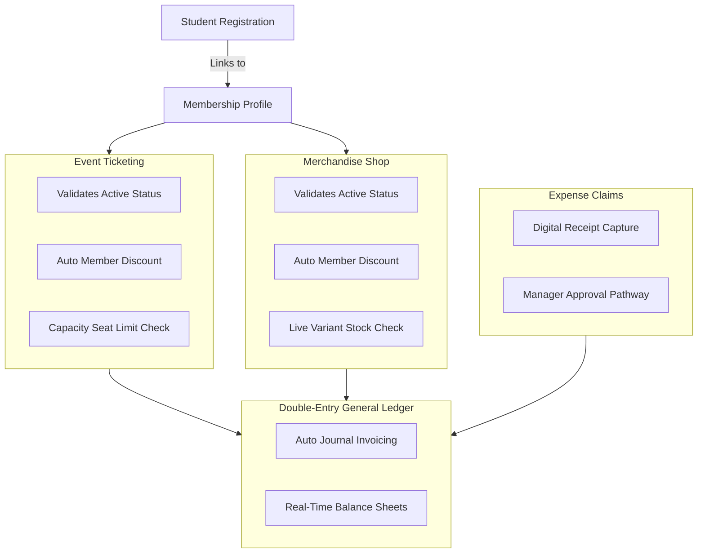

# 🎒 Skyline ClubHub (Odoo Edition)

A unified enterprise-grade digital backbone built natively on the **Odoo Framework** to run the Skyline Student Association's events, memberships, merchandise, and finances in one integrated ecosystem. This replaces messy spreadsheets, cash handling, paper notebooks, fragmented group chats, and manual receipt chasing.

---

## 🛠 Tech Stack

- **Core Logic:** Python (Odoo Framework Engine)
- **Database:** PostgreSQL (Relational Database Management System)
- **Frontend UI:** Owl JavaScript Framework / QWeb XML Layout Templates

---

## 🧭 Core Application Flow

---

## ✨ Features by Module

### 👥 1. Accounts & Membership (CRM)

- **Campus Sign-up:** Simple online profile registration capturing student IDs and contact details.
- **Verification Status:** Relational tracking of who has paid their dues (`Active`, `Expired`, or `None`).
- **Renewal System:** Automated background cron jobs check validity dates and fire out automated email renewal alerts before a card expires.
- **Gate Validation:** Generates a digital profile card with a scannable verification link.

### 🎟️ 2. Events & Ticketing

- **Gala Management:** Easily publish events with custom ticket capacity caps, venue details, and booking windows.
- **Tiered Pricing:** The system automatically checks membership status to apply the correct price tier (Member vs. Non-Member rates) during checkout.
- **Door Check-in:** Dispatches unique, secure QR tickets via email. Volunteers scan tickets at the entrance using a responsive phone interface, updating check-in states in real time.
- **Reports:** Tracks ticket revenue, attendance rates, and no-shows automatically.

### 📢 3. Centralized Announcements

- **Broadcast Engine:** Admins create an update once, and the system automatically posts it to the public website feed while firing an email broadcast to all members.
- **Permanent Log:** Creates an un-deletable chronological archive of all official club decisions, ensuring updates never get buried in group chats.

### 🛍️ 4. Merchandise Store (E-Commerce)

- **Online Catalogue:** Mobile-ready storefront for ordering club hoodies and T-shirts at any hour.
- **Matrix Stock Control:** Real-time stock counts mapped across size variants (`S`, `M`, `L`, `XL`). The system holds items for 10 minutes during checkout to avoid overselling.
- **Discount Engine:** Applies custom merchandise discount percentages automatically for active members.
- **Order Tracker:** Clean pipeline tracking for fulfillment states (`Paid` ➔ `Ready for Pick up` ➔ `Collected`).

### 📋 5. Fundraiser Task Board (Project)

- **Campaign Planning:** Build specific tracking profiles for club activities (e.g., a campus bake sale) with visual targets.
- **Visual Kanban:** Simple columns (`To Do`, `In Progress`, `Done`) to distribute tasks (baking, purchasing supplies, managing tables) among volunteers.
- **Progress Indicators:** A real-time overview displaying task completion percentages and highlighting overdue deadlines.

### 💰 6. Financial Treasury Ledger (Accounting)

- **Unified Books:** Every payment (dues, apparel orders, gala tickets) automatically registers as an income journal entry in a central double-entry bookkeeping system.
- **Expense Claims:** Volunteers submit reimbursement requests by uploading images of their receipts directly to the cloud dashboard.
- **Auditable Pathway:** Built-in verification loop requiring the treasurer to review and approve receipt attachments before funds are cleared.
- **Reporting:** Instant real-time breakdown of current cash balances, category spending, and data extraction to CSV spreadsheets.

---

## 🔐 Security & Constraints

- **Role-Based Access Control:** Strict security parameters define access permissions across roles: `Student` (Portal viewing and ordering), `Volunteer` (Task editing and gate scanning), and `Leadership Team` (Full finance entries and global dashboards).
- **Append-Only Ledger:** Financial history entries cannot be deleted or modified; corrections require a reversing accounting balance entry.
- **Server-Side Pricing Validation:** Item amounts, member balances, and inventory adjustments are computed exclusively on the backend to prevent malicious price overrides.

---

## 👥 Team

| Name | GitHub |
| ---- | ------ |
| Jagdish Sahu      | [@opJScoder](https://github.com/opJScoder)        |
| Himanshu Tripathi | [@TripathiHub](https://github.com/TripathiHub)      |
