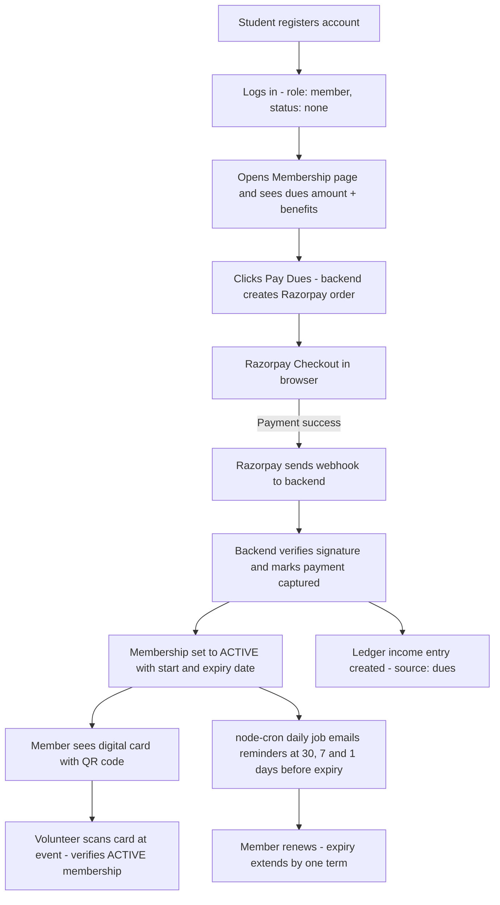
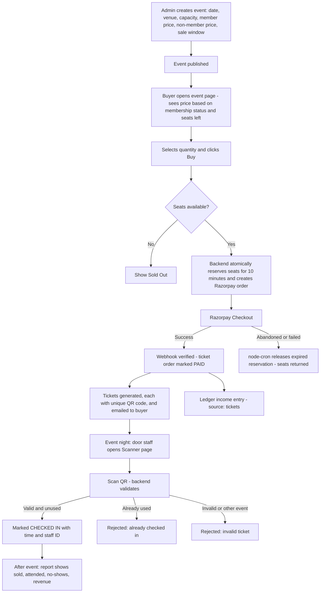
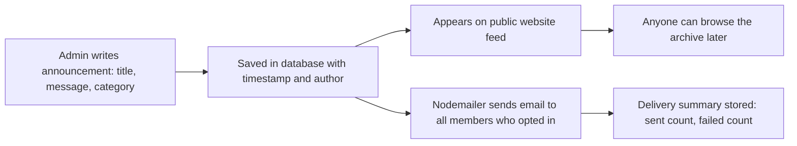
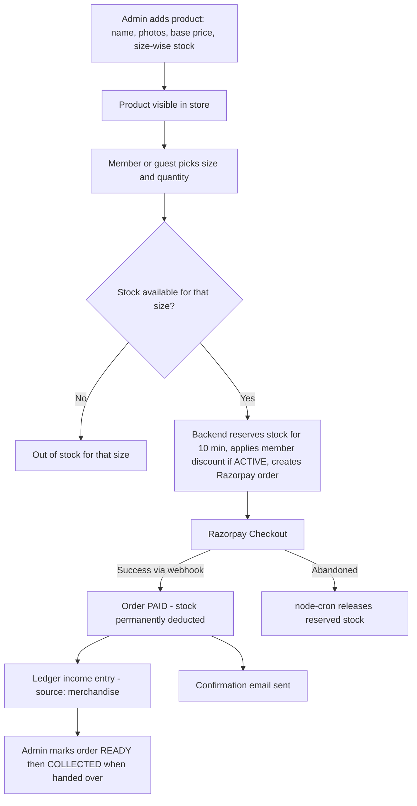
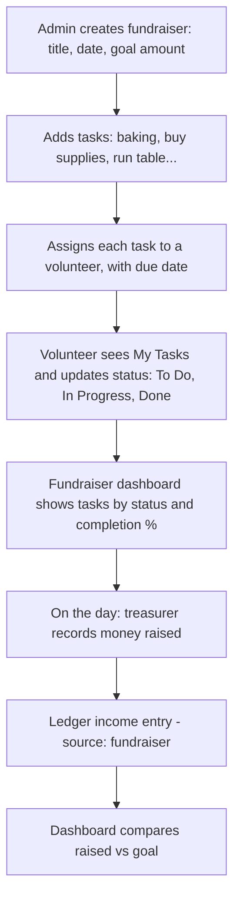
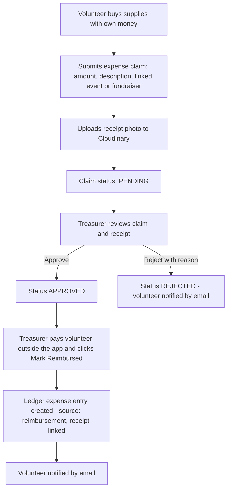
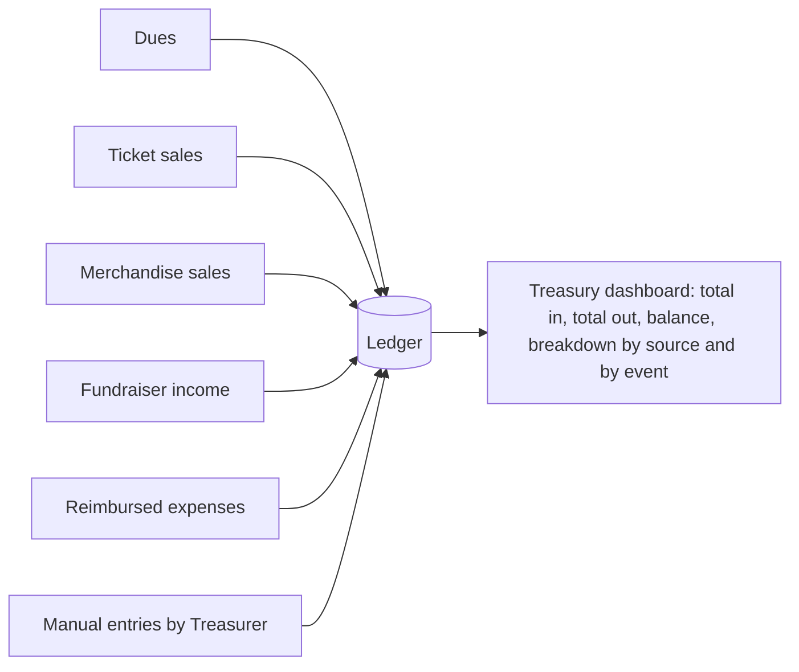
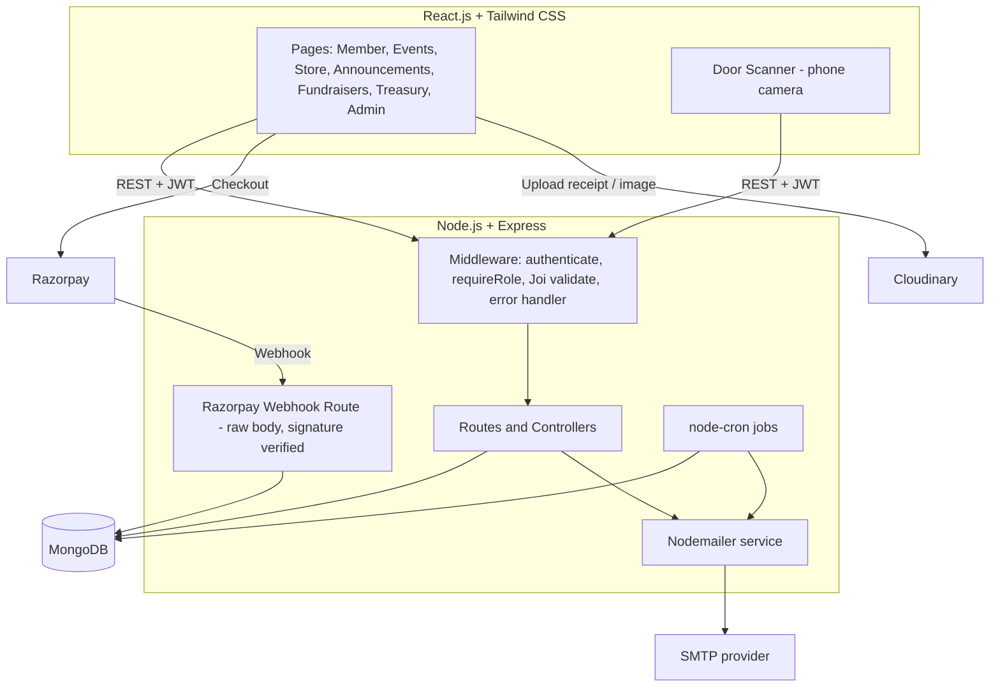
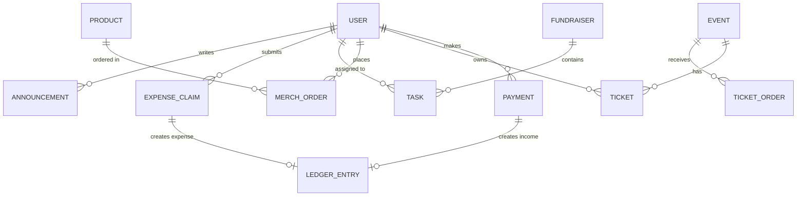

<p align="center">
  <h1 align="center">🎒 Skyline ClubHub</h1>
  <p align="center"><i>One platform to run a student club's events, members and money — no more spreadsheets, WhatsApp groups and notebooks.</i></p>
</p>

<p align="center">
  
  
  
  
  
  
  
  
  
  
  
</p>

<p align="center">
  <a href="#-overview">Overview</a> ·
  <a href="#-how-the-club-runs-today-vs-with-clubhub">Today vs ClubHub</a> ·
  <a href="#-user-roles--permissions">Roles</a> ·
  <a href="#-app-flow-end-to-end">App Flow</a> ·
  <a href="#-features-by-module">Features</a> ·
  <a href="#-tech-stack">Tech Stack</a> ·
  <a href="#-architecture">Architecture</a> ·
  <a href="#-database-design-mongodb">Database</a> ·
  <a href="#-api-reference">API</a> ·
  <a href="#-getting-started">Getting Started</a>
</p>

---

## 📖 Overview

The **Skyline Student Association** runs events, sells memberships and merchandise, and manages a small budget raised from dues, ticket sales and fundraisers. Today that is scattered across a spreadsheet, cash at the door, a paper notebook, WhatsApp broadcasts and a pile of receipts. Members lose track of events, money goes missing, and nobody knows who still owes what.

**Skyline ClubHub** is one unified platform that replaces all of it:

- **Members** — sign up, pay dues online, get a digital membership card (QR), and get reminded before it expires.
- **Events & tickets** — sell tickets online with member / non-member pricing and a seat cap, then check people in at the door by scanning a QR code.
- **Announcements** — write once; it is published on the website, emailed to every member, and stored as a permanent record.
- **Merchandise store** — sell hoodies and T-shirts by size, take payment online, and track live stock.
- **Fundraisers** — break a fundraiser into tasks, assign volunteers, and see progress at a glance.
- **Treasury** — every rupee in (dues, tickets, merch, fundraisers) and out (reimbursed expenses with receipts) lands in one ledger, so the treasurer can explain where the money went in a single screen.

> All amounts are in **INR (₹)** and are stored as integers in **paise** (₹1 = 100 paise) to avoid floating-point errors.

---

## 🔄 How the Club Runs Today vs. With ClubHub

| Area                  | Today                                   | With ClubHub                                                                 |
| --------------------- | --------------------------------------- | ---------------------------------------------------------------------------- |
| Member sign-ups       | Spreadsheet                             | Online registration, member profiles, dues payment, QR membership card       |
| Membership renewals   | Nobody remembers                        | Automated email reminders (30 / 7 / 1 days before expiry) via `node-cron`    |
| Event tickets         | Cash at the door                        | Online sales, member/non-member pricing, seat limit, QR tickets, door scanner |
| Club budget           | Notebook                                | Automatic ledger of income and expenses with live balance                    |
| Announcements         | Same message pasted into many WhatsApps | One post → website feed + email to all members + archived history            |
| Volunteer expenses    | Chasing receipts                        | Submit expense with receipt photo (Cloudinary) → treasurer approves → reimbursed |
| Merchandise           | Manual paper orders                     | Online store with size-wise stock, online payment, order tracking            |
| Fundraiser planning   | Lives in a group chat                   | Task board with owners, statuses and a progress bar                          |

---

## 👥 User Roles & Permissions

Authentication uses **JWT + bcrypt**. Every account has exactly one role, stored in `users.role`. Role checks are enforced on the server by middleware (`requireRole(...)`), never only in the UI.

| Role          | Who they are                                      | What they can do                                                                                                                                   |
| ------------- | ------------------------------------------------- | -------------------------------------------------------------------------------------------------------------------------------------------------- |
| **Guest**     | Not logged in                                     | View public announcements, view published events, view the merch catalogue, register / log in. Non-members may buy event tickets after creating an account. |
| **Member**    | Registered student (account exists)               | Everything a guest can, plus: pay dues, view/download membership card, buy tickets and merch (member prices apply only while membership is **active**), view own orders/tickets. |
| **Volunteer** | Member who helps organise                         | Everything a member can, plus: be assigned fundraiser tasks and update their status, scan tickets at the door (check-in), submit expense claims with receipts. |
| **Treasurer** | Elected finance officer                           | Everything a volunteer can, plus: approve/reject expense claims, record manual income/expense entries, view the full ledger and financial reports, export CSV. |
| **Admin**     | President / leadership team                       | Full access: manage members and roles, create events, products and fundraisers, publish announcements, configure dues & discounts, view all reports. |

> **Membership status is separate from role.** A user is a `member` (role) whose `membershipStatus` is `none`, `active`, or `expired`. Only `active` members get member pricing and member discounts.

---

## 🧭 App Flow (End to End)

This is how one semester flows through the system. Each numbered flow maps to a real situation in the club's year.

### 0. Authentication flow (applies everywhere)

1. User registers with name, email, password (and optional phone / student ID). Input is validated by **Joi**; password is hashed with **bcrypt**.
2. User logs in → server returns a **JWT** (contains `userId` and `role`, expires per `JWT_EXPIRES_IN`).
3. The React app stores the token and sends it as `Authorization: Bearer <token>` on every request.
4. Backend middleware `authenticate` verifies the token; `requireRole` checks permissions. Invalid/expired token → `401`; wrong role → `403`.

### 1. A new student joins (Membership flow)



- **Dues amount** and **membership term** are configured by Admin in Settings (default: one term ending on the configured `membershipExpiryDate`, e.g. 31 Dec of the current year).
- **Benefits** of an active membership: discounted ticket price (the event's `memberPrice`), merchandise discount (`memberDiscountPercent`), and member-only events.
- **Verification at events:** the membership card shows a QR encoding the member's ID. Scanning it calls `GET /api/members/verify/:memberId`, which returns name + `active | expired | none`.
- **Expiry:** a daily cron job flips memberships whose `expiresAt` has passed from `active` to `expired`.

### 2. Selling tickets for the Spring Gala (Events & ticketing flow)



Key rules:

- **Two prices per event:** `memberPrice` and `nonMemberPrice`. The price is decided on the server from the logged-in user's membership status — the client cannot choose it.
- **Seat limit:** `capacity` is the maximum. Remaining seats = `capacity − (sold + currently reserved)`. Reservation uses an atomic MongoDB update (`findOneAndUpdate` with a condition) so two buyers can never take the last seat.
- **Reservation hold:** seats are held for **10 minutes** while the buyer pays. If payment is not completed, a cron job releases them.
- **Ticket QR:** each ticket has a unique random `ticketCode`; the QR encodes only that code (no personal data).
- **Door check-in:** works on any phone browser with a camera; no printed list. A manual search by ticket code / buyer name is available as a fallback.
- **Post-event report:** tickets sold, attendees checked in, no-shows, attendance %, and revenue (tickets sold × price).

### 3. Announcing the next meeting (Announcements flow)



- One post reaches everyone: **website feed** (public) **+ email** (all members with announcement emails enabled).
- Categories: `meeting`, `deadline`, `change-of-plan`, `general`. Pinned announcements stay on top.
- Every announcement is **permanently stored** with author and time, so "what was said and when" is never lost in a chat. Announcements can be edited (edit history timestamp kept) but not silently deleted by non-admins.
- Emails are sent in small batches to respect SMTP limits.

### 4. Ordering hoodies (Merchandise flow)



- **Live stock** is tracked per size (`S, M, L, XL`, or any sizes the admin defines). The store always shows what is actually left.
- **Member discount:** a percentage set by Admin, applied automatically only to **active** members.
- **Order statuses:** `pending_payment → paid → ready → collected` (or `cancelled` / `expired`).
- Admin gets an order list per product/size so they know exactly how many of each to order from the supplier.

### 5. Planning a fundraiser (Fundraiser & tasks flow)



- **At a glance:** a board with three columns (To Do / In Progress / Done), who owns each task, due dates, and overdue highlighting.
- **"Is it on track?"** = tasks done ÷ total tasks, plus overdue task count and `raised ÷ goal`.
- Only admins create/assign tasks; the assigned volunteer (or admin) can change a task's status.

### 6. Volunteer expenses (Reimbursement flow)



- Receipts are uploaded **directly to Cloudinary** and the secure URL is stored with the claim — no more chasing paper.
- A claim cannot be marked reimbursed without a receipt.
- The ledger entry keeps a link to the receipt, so any expense can be audited later.

### 7. The treasurer closes the books (Treasury flow)



- **Income** entries are created **automatically** when a Razorpay payment is confirmed (dues, tickets, merch). Fundraiser income and any other cash are added manually by the treasurer.
- **Expense** entries are created automatically when an expense claim is marked reimbursed, or manually for club-level costs (e.g. venue deposit).
- The dashboard shows: **total income, total expenses, current balance**, income split by source, expenses by category, and a per-event profit view (ticket income − linked expenses).
- Any ledger entry can be filtered by date/source/event and exported to **CSV**. Ledger entries are **append-only** — corrections are made by adding a reversing entry, never by editing history.

---

## ✨ Features by Module

**Accounts & Membership**
- Register / login with validation, JWT sessions, role-based access
- Member profile (name, email, phone, student ID) and membership card with QR
- Online dues payment, automatic activation and expiry date
- Renewal reminders by email; automatic expiry handling
- Membership verification endpoint for door staff
- Admin member directory with search and status filter

**Events & Ticketing**
- Create/publish/cancel events with capacity, two price tiers and sale window
- Real-time seats-left count; sold-out state
- Razorpay checkout, QR ticket emailed and viewable in "My Tickets"
- Door scanner page with duplicate/invalid detection
- Attendance and revenue report per event

**Announcements**
- Rich-text-free simple message editor (title, body, category, pin)
- Public feed + email broadcast + permanent archive

**Merchandise**
- Product catalogue with images (Cloudinary), size-wise stock
- Member discounts, online payment, order tracking, collection status
- Admin stock dashboard and order list

**Fundraisers & Tasks**
- Fundraiser with goal; task board with owners, due dates, statuses
- Progress indicators and overdue highlighting
- "My Tasks" view for volunteers

**Treasury**
- Unified ledger, live balance, breakdown charts
- Expense claims with receipts and approval workflow
- CSV export

---

## 🛠 Tech Stack

### Main stack

| Layer    | Technology                | Purpose                                                  |
| -------- | ------------------------- | -------------------------------------------------------- |
| Frontend | **React.js + Tailwind CSS** | Responsive UI that works on phones (needed for ordering, QR card and door scanning) |
| Backend  | **Node.js + Express**     | REST API, business rules, webhooks, scheduled jobs       |
| Database | **MongoDB** (via Mongoose) | Stores users, events, tickets, orders, ledger, etc.     |

### Extra pieces

| Concern                       | Technology         | How it is used                                                                          |
| ----------------------------- | ------------------ | --------------------------------------------------------------------------------------- |
| Login & roles                 | **JWT + bcrypt**   | bcrypt hashes passwords; JWT carries identity + role; middleware enforces permissions   |
| Validation                    | **Joi**            | Every request body/query/params is validated before reaching controllers                |
| Payments                      | **Razorpay**       | Orders created server-side; payment confirmed **only** via a verified **webhook route** |
| Receipts & images             | **Cloudinary**     | Stores expense receipt photos and merchandise images                                    |
| Announcements / emails        | **Nodemailer**     | Announcement broadcasts, ticket delivery, order confirmations, claim updates            |
| Notifications / reminders     | **node-cron**      | Membership renewal reminders, expiry job, release of unpaid seat/stock reservations     |

> Small supporting libraries (not part of the headline stack): `mongoose` (MongoDB ODM), `qrcode` (generate QR images), `html5-qrcode` (browser camera scanner), `axios` (HTTP client), `react-router-dom` (routing), `recharts` (treasury charts), `multer` (file handling for uploads).

---

## 🏗 Architecture



**Important design rules**

1. **The webhook is the source of truth for payments.** The browser's "payment success" callback is only used to show a UI message. Tickets, memberships, orders and ledger entries are created/activated **only** inside the Razorpay webhook handler after the signature is verified.
2. **Webhooks are idempotent.** Each Razorpay payment ID is stored with a unique index; a repeated webhook does nothing the second time.
3. **Prices are never trusted from the client.** The server computes price, discount and totals.
4. **Reservations prevent overselling.** Seats and stock are reserved atomically with a 10-minute expiry; a cron job releases expired holds.
5. **The ledger is append-only.** Nothing that affects money is silently edited or deleted.

---

## 🗄 Database Design (MongoDB)



| Collection         | Key fields                                                                                                                                                                  |
| ------------------ | --------------------------------------------------------------------------------------------------------------------------------------------------------------------------- |
| `users`            | `name`, `email` (unique), `passwordHash`, `phone`, `studentId`, `role` (`member`/`volunteer`/`treasurer`/`admin`), `membershipStatus` (`none`/`active`/`expired`), `membershipStartsAt`, `membershipExpiresAt`, `memberId` (unique, encoded in QR), `emailPrefs.announcements`, `createdAt` |
| `settings`         | `duesAmount`, `membershipExpiryDate`, `memberDiscountPercent`, `openingBalance` (single document)                                                                          |
| `events`           | `title`, `description`, `venue`, `startsAt`, `capacity`, `memberPrice`, `nonMemberPrice`, `saleStartsAt`, `saleEndsAt`, `soldCount`, `reservedCount`, `status` (`draft`/`published`/`cancelled`/`completed`) |
| `ticketOrders`     | `userId`, `eventId`, `quantity`, `unitPrice`, `totalAmount`, `razorpayOrderId`, `status` (`reserved`/`paid`/`expired`/`failed`), `reservedUntil`                               |
| `tickets`          | `orderId`, `eventId`, `userId`, `ticketCode` (unique), `checkedIn`, `checkedInAt`, `checkedInBy`                                                                              |
| `announcements`    | `title`, `body`, `category`, `pinned`, `authorId`, `emailsSent`, `emailsFailed`, `createdAt`, `updatedAt`                                                                    |
| `products`         | `name`, `description`, `images[]` (Cloudinary URLs), `price`, `variants[{ size, stock, reserved }]`, `isActive`                                                               |
| `merchOrders`      | `userId`, `items[{ productId, size, quantity, unitPrice }]`, `discountApplied`, `totalAmount`, `razorpayOrderId`, `status` (`pending_payment`/`paid`/`ready`/`collected`/`cancelled`/`expired`), `reservedUntil` |
| `fundraisers`      | `title`, `description`, `eventDate`, `goalAmount`, `status`                                                                                                                  |
| `tasks`            | `fundraiserId`, `title`, `description`, `assigneeId`, `dueDate`, `status` (`todo`/`in_progress`/`done`)                                                                       |
| `payments`         | `userId`, `purpose` (`dues`/`ticket`/`merch`), `referenceId`, `amount`, `razorpayOrderId`, `razorpayPaymentId` (unique), `status`, `capturedAt`                               |
| `expenseClaims`    | `claimantId`, `amount`, `description`, `eventId?`, `fundraiserId?`, `receiptUrl`, `status` (`pending`/`approved`/`rejected`/`reimbursed`), `reviewedBy`, `rejectReason`          |
| `ledgerEntries`    | `type` (`income`/`expense`), `source` (`dues`/`tickets`/`merchandise`/`fundraiser`/`reimbursement`/`other`), `amount`, `description`, `eventId?`, `receiptUrl?`, `refId`, `createdBy`, `date` (append-only) |

All amounts are integers in **paise**.

---

## 📱 Screens

| #  | Screen                      | Who                | Purpose                                                           |
| -- | --------------------------- | ------------------ | ----------------------------------------------------------------- |
| 1  | Register / Login            | Guest              | Create account, authenticate                                      |
| 2  | Home / Announcements feed   | Everyone           | Latest and pinned announcements, upcoming events                  |
| 3  | Membership                  | Member             | Dues status, pay/renew, QR membership card                        |
| 4  | Events list & detail        | Everyone           | Browse events, see price for you and seats left, buy tickets      |
| 5  | My Tickets                  | Member             | View QR tickets                                                   |
| 6  | Door Scanner                | Volunteer / Admin  | Scan tickets and membership cards                                 |
| 7  | Merch Store & Cart          | Everyone           | Browse products, choose size, pay                                 |
| 8  | My Orders                   | Member             | Track merchandise orders                                          |
| 9  | Fundraisers & Task Board    | Volunteer / Admin  | See tasks, owners, progress; update status                        |
| 10 | Submit Expense              | Volunteer          | Upload receipt, track claim status                                |
| 11 | Treasury Dashboard          | Treasurer / Admin  | Income, expenses, balance, charts, ledger, CSV export             |
| 12 | Expense Review              | Treasurer          | Approve / reject / mark reimbursed                                |
| 13 | Admin Panel                 | Admin              | Manage members/roles, events, products, announcements, settings   |
| 14 | Event Report                | Admin / Treasurer  | Sold, attended, no-shows, revenue                                 |
| 15 | Profile / Settings          | Member             | Edit details, email preferences                                   |

---

## 📁 Project Structure

```
skyline-clubhub/
├── client/                        # React.js + Tailwind CSS
│   ├── src/
│   │   ├── components/            # Reusable UI (cards, forms, charts, QR display)
│   │   ├── pages/                 # One file per screen listed above
│   │   ├── context/               # Auth context (user + token)
│   │   ├── hooks/
│   │   ├── services/              # API wrappers (axios)
│   │   ├── routes/                # Protected-route wrappers by role
│   │   └── App.jsx
│   ├── public/
│   ├── .env.example
│   └── package.json
├── server/                        # Node.js + Express
│   ├── src/
│   │   ├── config/                # DB, Razorpay, Cloudinary, mailer setup
│   │   ├── models/                # Mongoose models (collections above)
│   │   ├── routes/
│   │   ├── controllers/
│   │   ├── middleware/            # authenticate, requireRole, validate (Joi), errorHandler
│   │   ├── validators/            # Joi schemas
│   │   ├── services/              # payment, ticket, stock, ledger, email logic
│   │   ├── jobs/                  # node-cron jobs
│   │   ├── utils/
│   │   └── server.js
│   ├── .env.example
│   └── package.json
└── README.md
```

---

## ⏰ Scheduled Jobs (node-cron)

| Job                         | Schedule (server time) | What it does                                                                                  |
| --------------------------- | ---------------------- | --------------------------------------------------------------------------------------------- |
| Membership renewal reminder | Daily, 09:00           | Emails active members whose membership expires in **30, 7 or 1** days                         |
| Membership expiry           | Daily, 00:10           | Sets `membershipStatus = expired` where `membershipExpiresAt` has passed                      |
| Release reservations        | Every 5 minutes        | Frees seats/stock for ticket and merch orders still unpaid after their `reservedUntil` time   |
| Event reminder *(optional)* | Daily, 09:00           | Emails ticket holders the day before their event                                              |

---

## 📡 API Reference

All routes are prefixed with `/api`. "Auth" means a valid JWT is required.

### Auth & users
| Method | Endpoint                    | Access  | Description                          |
| ------ | --------------------------- | ------- | ------------------------------------ |
| POST   | `/auth/register`            | Public  | Create an account                    |
| POST   | `/auth/login`               | Public  | Log in, receive JWT                  |
| GET    | `/auth/me`                  | Auth    | Current user + membership info       |
| PUT    | `/users/me`                 | Auth    | Update own profile / email prefs     |
| GET    | `/users`                    | Admin   | List/search members                  |
| PUT    | `/users/:id/role`           | Admin   | Change a user's role                 |

### Membership
| Method | Endpoint                         | Access           | Description                                  |
| ------ | -------------------------------- | ---------------- | -------------------------------------------- |
| POST   | `/membership/pay`                | Auth             | Create Razorpay order for dues               |
| GET    | `/members/verify/:memberId`      | Volunteer+       | Verify membership status from QR             |

### Events & tickets
| Method | Endpoint                         | Access           | Description                                      |
| ------ | -------------------------------- | ---------------- | ------------------------------------------------ |
| GET    | `/events` · `/events/:id`        | Public           | List / view events (includes seats left)         |
| POST   | `/events`                        | Admin            | Create event                                     |
| PUT    | `/events/:id`                    | Admin            | Update / publish / cancel event                  |
| POST   | `/events/:id/tickets/order`      | Auth             | Reserve seats + create Razorpay order            |
| GET    | `/tickets/mine`                  | Auth             | My tickets                                       |
| POST   | `/tickets/check-in`              | Volunteer+       | Body: `{ ticketCode }` → check in                |
| GET    | `/events/:id/report`             | Admin/Treasurer  | Sold, attended, no-shows, revenue                |

### Announcements
| Method | Endpoint               | Access | Description                                  |
| ------ | ---------------------- | ------ | -------------------------------------------- |
| GET    | `/announcements`       | Public | Paginated feed / archive                     |
| POST   | `/announcements`       | Admin  | Publish + email all opted-in members         |
| PUT    | `/announcements/:id`   | Admin  | Edit / pin                                   |

### Merchandise
| Method | Endpoint                     | Access | Description                                   |
| ------ | ---------------------------- | ------ | --------------------------------------------- |
| GET    | `/products`                  | Public | Catalogue with live stock per size            |
| POST   | `/products`                  | Admin  | Create product                                |
| PUT    | `/products/:id`              | Admin  | Update product / stock                        |
| POST   | `/merch/orders`              | Auth   | Reserve stock + create Razorpay order         |
| GET    | `/merch/orders/mine`         | Auth   | My orders                                     |
| GET    | `/merch/orders`              | Admin  | All orders                                    |
| PUT    | `/merch/orders/:id/status`   | Admin  | Mark `ready` / `collected` / `cancelled`      |

### Fundraisers & tasks
| Method | Endpoint                          | Access           | Description                                  |
| ------ | --------------------------------- | ---------------- | -------------------------------------------- |
| GET    | `/fundraisers` · `/fundraisers/:id` | Volunteer+     | List / view with progress                    |
| POST   | `/fundraisers`                    | Admin            | Create fundraiser                            |
| POST   | `/fundraisers/:id/tasks`          | Admin            | Create + assign a task                       |
| PUT    | `/tasks/:id`                      | Assignee/Admin   | Update task status or details                |
| GET    | `/tasks/mine`                     | Volunteer+       | My assigned tasks                            |

### Expenses & treasury
| Method | Endpoint                          | Access           | Description                                       |
| ------ | --------------------------------- | ---------------- | ------------------------------------------------- |
| POST   | `/expenses`                       | Volunteer+       | Submit claim with `receiptUrl`                    |
| GET    | `/expenses/mine`                  | Volunteer+       | My claims                                         |
| GET    | `/expenses`                       | Treasurer/Admin  | All claims (filter by status)                     |
| PUT    | `/expenses/:id/review`            | Treasurer        | Approve / reject                                  |
| PUT    | `/expenses/:id/reimburse`         | Treasurer        | Mark reimbursed → creates ledger expense          |
| GET    | `/ledger`                         | Treasurer/Admin  | Ledger entries (filters: date, source, event)     |
| POST   | `/ledger`                         | Treasurer        | Manual income/expense entry                       |
| GET    | `/ledger/summary`                 | Treasurer/Admin  | Totals, balance, breakdown by source/event        |
| GET    | `/ledger/export`                  | Treasurer/Admin  | CSV export                                        |

### Payments
| Method | Endpoint                  | Access                       | Description                                                                                  |
| ------ | ------------------------- | ---------------------------- | -------------------------------------------------------------------------------------------- |
| POST   | `/payments/webhook`       | Razorpay only (signature)    | Verifies `X-Razorpay-Signature` on the **raw body**; activates membership / issues tickets / confirms orders; writes ledger |

---

## 🚀 Getting Started

### Prerequisites

- Node.js 18+ and npm
- A MongoDB database (local, or a free MongoDB Atlas cluster)
- A [Razorpay](https://razorpay.com) account (test mode keys are enough)
- A [Cloudinary](https://cloudinary.com) account
- An SMTP account for Nodemailer (e.g. Gmail app password or any SMTP provider)

### 1. Clone and install

```bash
git clone https://github.com/opJScoder/skyline-clubhub.git
cd skyline-clubhub

cd client && npm install
cd ../server && npm install
```

### 2. Configure environment variables

**`server/.env`**

```env
PORT=5000
CLIENT_URL=http://localhost:5173

MONGODB_URI=mongodb://localhost:27017/skyline-clubhub

JWT_SECRET=replace_with_a_long_random_string
JWT_EXPIRES_IN=7d

RAZORPAY_KEY_ID=rzp_test_xxxxxxxx
RAZORPAY_KEY_SECRET=your_key_secret
RAZORPAY_WEBHOOK_SECRET=your_webhook_secret

CLOUDINARY_CLOUD_NAME=your_cloud_name
CLOUDINARY_API_KEY=your_api_key
CLOUDINARY_API_SECRET=your_api_secret

SMTP_HOST=smtp.example.com
SMTP_PORT=587
SMTP_USER=your_smtp_user
SMTP_PASS=your_smtp_password
MAIL_FROM="Skyline Student Association <no-reply@example.com>"
```

**`client/.env`**

```env
VITE_API_URL=http://localhost:5000/api
VITE_RAZORPAY_KEY_ID=rzp_test_xxxxxxxx
VITE_CLOUDINARY_CLOUD_NAME=your_cloud_name
VITE_CLOUDINARY_UPLOAD_PRESET=your_unsigned_upload_preset
```

### 3. Set up Razorpay webhook (needed for payments to complete)

1. In the Razorpay dashboard go to **Settings → Webhooks → Add new webhook**.
2. URL: `https://<your-backend-url>/api/payments/webhook`
3. Secret: the same value as `RAZORPAY_WEBHOOK_SECRET`.
4. Events: `payment.captured` and `payment.failed`.
5. For local development, expose your server with a tunnel (e.g. `ngrok http 5000`) and use that URL.

### 4. Create the first admin

Register normally through the app, then promote that user to `admin` once:

```bash
cd server
npm run make-admin -- you@example.com
```

Then log in as admin and open **Admin → Settings** to set the **dues amount**, **membership expiry date** and **member discount %**.

### 5. Run it locally

```bash
# terminal 1 – backend
cd server && npm run dev

# terminal 2 – frontend
cd client && npm run dev
```

Frontend: **http://localhost:5173** · API: **http://localhost:5000**

### 6. Build for production

```bash
cd client && npm run build    # outputs client/dist
cd server && npm start        # runs the Express server (cron jobs start with it)
```

> The backend must run as a **long-lived process** (not serverless) so `node-cron` jobs keep running. Keep exactly one instance of the API running, or the cron jobs will fire more than once.

---

## 🔐 Security Notes

- Passwords hashed with bcrypt; never stored or logged in plain text.
- JWT secret and all API keys live only in environment variables.
- All inputs validated with Joi; unknown fields are stripped.
- Razorpay webhook verified using HMAC signature on the raw request body; duplicate payment IDs are ignored.
- Role checks happen on the server for every protected route.
- Ticket QR codes contain only a random code — no personal data.
- CORS restricted to `CLIENT_URL`.

---

## ✅ Scope

**Included:** everything described in the flows above.

**Not included (by design):** automatic refunds (handle manually and record a reversing ledger entry), automatic payouts to volunteers (the treasurer pays outside the app and marks the claim reimbursed), WhatsApp integration, and native mobile apps (the web app is mobile-friendly).

---

## 👥 Team

| Name | GitHub |
| ---- | ------ |
| Jagdish Sahu      | [@opJScoder](https://github.com/opJScoder)        |
| Himanshu Tripathi | [@TripathiHub](https://github.com/TripathiHub)      |
